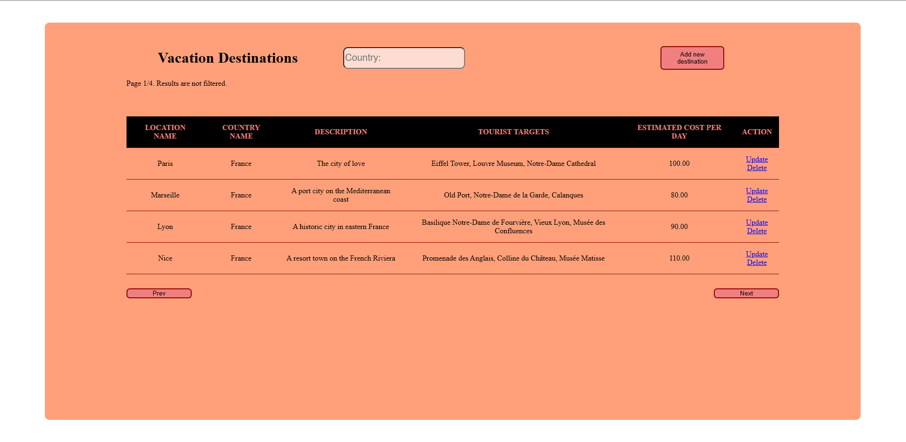
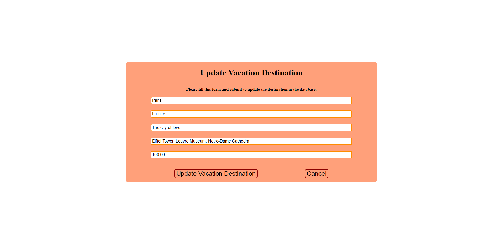

# Vacation Destinations Manager

This is an assignment from the Web Programming course of UBB.

This repository contains two projects:
* DestinationsManager-PlainJS
* DestinationsManager-Angular

## DestinationsManager-PlainJS

This is a server-side web application in PHP. The application manipulates a database with one table and implements the following base operations: select, insert, delete, update. Also the web application is using AJAX for getting data asynchronously from the web server. It contains several web pages (client-side html or server-side php).

The application is used for managing vacation destinations. A destination has in the database besides the name of the location (i.e. city etc.), the country name, description, tourist targets in that location and an estimated cost per day. The user can add, delete or modify the destinations and he can also browse the vacation destinations grouped by countries (AJAX was used for this). Vacation destination browsing is paged - destinations are displayed on pages with maximum 4 vacation destinations on a page.

A MySQL database is used, hosted using XAMPP. The PHP server itself was also hosted using XAMPP.

In this project:
* SQL injection attacks were avoided
* The user does not interact with IDs of any sort
* CSS was used for a pleasant appearance

## DestinationsManager-Angular

This is an Angular UI for the PHP project described above. The backend of this project is the same (i.e. the php code), only the frontend differs.

# Screenshots

Main page:

Updating an item:

There are a few pages and dialogs not displayed here.

# How to run

1. Install XAMPP. You should have an Apache and MySql server running.
2. Copy the project into the working directory (C:\xampp\htdocs).
3. Set-up the database. There is a SQL script inside the project that you can use to create the tables and add some data.
4. Update database connection details if necessary.
5. In the browser, go to "[localhost/VacationDestinationsManager-Website/DestinationsManager-PlainJS/showDestinations.html](localhost/VacationDestinationsManager-Website/DestinationsManager-PlainJS/showDestinations.html)" to test the PlainJS version (the Apache server must be running).
6. For the Angular version you need to run "ng serve" command in the project's directory. Check Angular documentation for more details.
